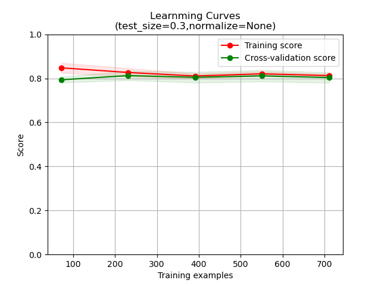

# 泰坦尼克号：灾难中的机器学习（Titanic: Machine Learning from Disaster）
> 本项目是基于国际知名机器学习竞赛网站Kaggle上广为人知的入门项目“泰坦尼克号”所搭建的机器学习模型，本模型将根据乘员的相关信息推断该乘员是否能够逃过和平时期死伤人数最为惨重的这次海难。    
> 相关信息详见：https://www.kaggle.com/c/titanic/
---

## 官方文件
> gender_submission.csv - 提交样例，需要提交至官方进行测试的文件模板    
> test.csv - 测试集，用于测试模型    
> train.csv - 训练集，用于训练模型    
---

## 数据集
> 在训练集中一共包含有891名乘员的相关信息，对于每位乘员具体包括船票等级、性别、年龄、同船兄弟/配偶数目、同船长辈/孩子数目、票号、乘客费用、船舱号、出发港等个人信息。    
> | Variable | Definition | Key |    
> | - | - | - |    
> | survival | Survival | 0 = No, 1 = Yes |    
> | pclass | Ticket class | 1 = 1st, 2 = 2nd, 3 = 3rd |    
> | sex | Sex |  |    
> | Age | Age in years |  |
> | sibsp | # of siblings / spouses aboard the Titanic |  |    
> | parch | # of parents / children aboard the Titanic |  |    
> | ticket | Ticket number |    
> | fare | Passenger fare |
> | cabin | Cabin number |    
> | embarked | Port of Embarkation | C = Cherbourg, Q = Queenstown, S = Southampton |    
> 
> 在训练集中，并不是所有乘员的信息都是完善的，根据实际情况可能需要将带有缺失项的乘员样本作剔除处理，同时在所给的乘员信息中实际上对该成员生存可能性判断有决定性的因素可能只有其中的某几项甚至一项，所以可以在正式训练之前对样本信息进行筛选和提取。    
> 对于乘员是否能够存活，该乘员在训练集中的编号、乘员名字是首先考虑排除在外的因素；在剩下的特征中，乘员的住舱信息有大量缺失，虽然可能成为推断依据但也可从别处获得耦合的信息故剔除该因素；乘员花销的船费和其登船港、船票等级都有关系，但是对于判断该乘员是否能够幸免于难也没有直接关系故剔除费用、起始港、船票编号等因素；在剩下的因素中，毫无疑问年龄和性别与该乘员是否能够存活有着直接的关系，同时乘员购买的船票等级将直接影响其住舱位置以及其他可能影响该乘员存活率的因素，而乘员的亲属信息（兄弟、配偶、父母、子女）等信息相较之下与乘员存活率关系就没有那么密切了。    
> 综上所述，我们将以乘员的船票等级、性别、年龄作为模型的输入进行训练，最终也将根据该三项内容对其他乘员存活与否进行推断，数据清洗后最终保留了714条有用的乘员信息，其中290人存活、424人遇难分别约占总人数的30%、70%，~~为了平衡训练集中的正负样本数量，最终将用来进行模型训练的样本将包含580条乘员信息，其中290条存活乘员信息，以及290条经随机抽样得到的遇难乘员信息。~~从整体来看样本比例没有异常倾斜尚在可接收范围内，且为了尽可能利用有限样本训练尽可能准确的模型，决定不根据标签均衡样本，直接采用全集进行训练。    
---

## 数据预处理
> 经过特征选取和数据清洗后，我们得到了包含290条正样本和290条负样本总计580条样本的数据集，该数据集中每个样本都有1个标签和3个特征值，1个标签即是否生还，3个特征值分别为乘员年龄、性别、船票等级。    
### 年龄
> 通过对原始数据集进行分析，以每10岁为一个区间将乘员进行归类，得到了如下乘员年龄分布列表
> | Age | Counts | Proportion |    
> | --- | --- | --- |    
> | 0~10 | 64 | 9% |    
> | 10~20 | 115 | 16% |    
> | 20~30 | 230 | 32% |    
> | 30~40 | 155 | 22% |    
> | 40~50 | 86 | 12% |    
> | 50~60 | 42 | 6% |    
> | 60~70 | 17 | 2% |    
> | 70~80 | 5 | 1% |    
> | Total | 714 | 100% |        
### 性别
> 原始记录中使用“male”和“female”分别表示男性和女性，为了便于模型训练令male=1，female=0。根据原始数据统计的结果表明，总体而言男性、女性乘员占比分别为65%、35%，另外分别对购买不同等级船票的乘员年龄与性别进行了统计
> | Pclass | Age | Male | Female | Total |    
> | --- | --- | --- | --- | --- |    
> | 1 |0~20|7|14|21|    
> | 1 |20~40|44|45|89|    
> | 1 |40~60|38|24|62|    
> | 1 |60~80|12|2|14|    
> | 2 |0~20|19|16|35|    
> | 2 |20~40|59|45|104|    
> | 2 |40~60|18|13|31|    
> | 2 |60~80|3|0|3|    
> | 3 |0~20|76|47|123|    
> | 3 |20~40|146|46|192|    
> | 3 |40~60|27|8|35|    
> | 3 |60~80|4|1|5|       
### 船票等级
> 众所周知，船票等级的不同将导致住舱分布不同，而住舱的分布将在一定程度上影响乘员在遇到危险时是否能够及时逃离遇难船只，所以这也是该项指标被保留下来的重要原因，经过统计得到如下列表
> | Pclass | count |    
> | --- | --- |    
> |1st|216|    
> |2nd|184|    
> |3rd|491|    
> |Total|891|    
### 综合分析
> 我们认为原始数据集是来自所有乘坐泰坦尼克号乘员总体的一个抽样，那么对于所有泰坦尼克号的乘员，我们可以使用年龄分布来估计所有泰坦尼克号乘员的年龄分布情况，在此可以使用StandardScale的方法对原始数据进行标准化，具体地就是将每组样本的年龄减去全集的样本均值再除以全集年龄分布的标准差得到标准年龄，以此作为训练样本。    
> 另外，综合上述统计结果，我们还可以做出如下合理推断，如果一位乘员购买了1等船票，若他是男性，则该乘员的年龄可能为40.9岁，若她是女性，则该乘员的年龄可能为33.3岁；如果一位乘员购买了2等船票，若他是男性，则该乘员的年龄可能为31.0岁，若她是女性，则该乘员的年龄可能为29.2岁；如果一位乘员购买了3等船票，若他是男性，则该乘员的年龄可能为26.8岁，若她是女性，则该乘员的年龄可能为22.7岁。由上述推断我们可以使用这项规则来填补年龄数据缺失的样本。    
> - 在Kaggle上与人讨论过是否需要对目前保留下来的这些特征分别进行标准化，我发现在进行标准化后的模型准确率可能比标准化前的略微下降，而整个标准化的过程也符合规范，所以对于原始数据进行特征工程处理的时候可能还需多加考虑和反复实验。
---

## 相关资料

